# Architecture Diagrams

This document contains comprehensive architecture diagrams for the Zitadel-based identity management system, covering the current POC and the planned Google Workspace clone. All diagrams use Mermaid syntax and are intended to be rendered in any Mermaid-compatible viewer (GitHub, GitLab, Obsidian, etc.).

---

## 1. System Overview - Current POC

This C4-style context diagram shows all components running in the current Docker Compose environment. The Go API on port 8082 handles token introspection, while the Workspace POC on port 8083 simulates Google Docs, Drive, and Admin surfaces. Zitadel on port 8090 acts as the central identity provider backed by PostgreSQL, with the Login v2 UI handling the authentication UX.

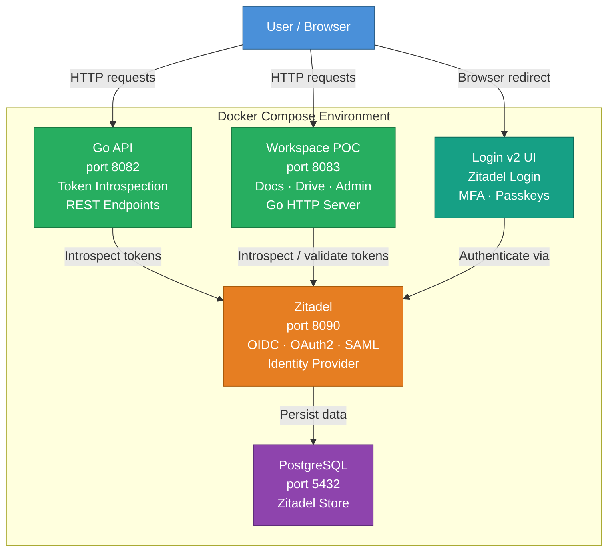

---

## 2. OIDC Authorization Code Flow with PKCE

This sequence diagram illustrates the full Authorization Code + PKCE flow used by browser-based applications. PKCE (Proof Key for Code Exchange) prevents authorization code interception attacks by binding the token request to a one-time verifier generated in the client. The result is three tokens: an access token for API calls, an ID token for identity claims, and a refresh token for silent renewal.

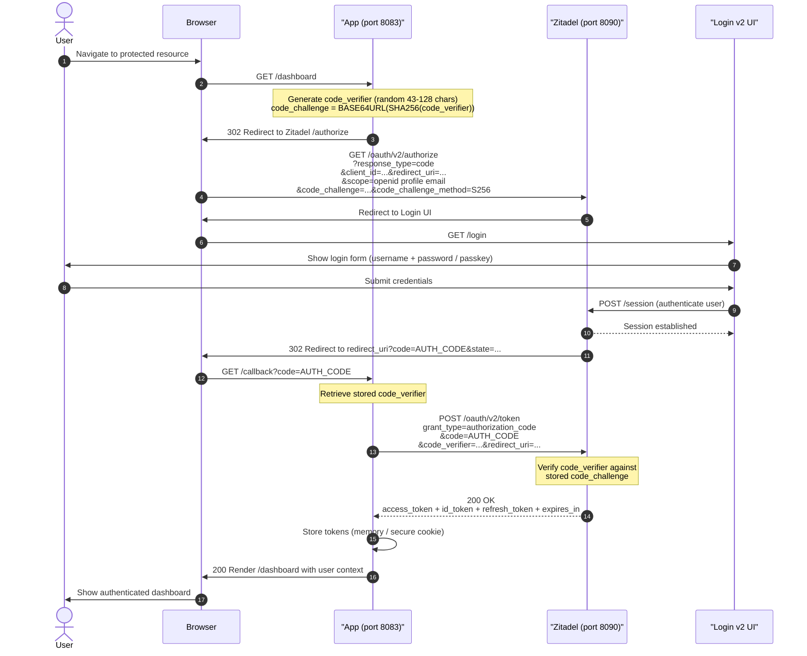

---

## 3. Token Introspection Flow

This sequence diagram shows how an API server validates an opaque or JWT access token by calling Zitadel's introspection endpoint. This approach is appropriate when the API does not want to manage JWKS key rotation locally, or when using opaque tokens. The introspection response includes active status, user claims, scopes, and expiry.

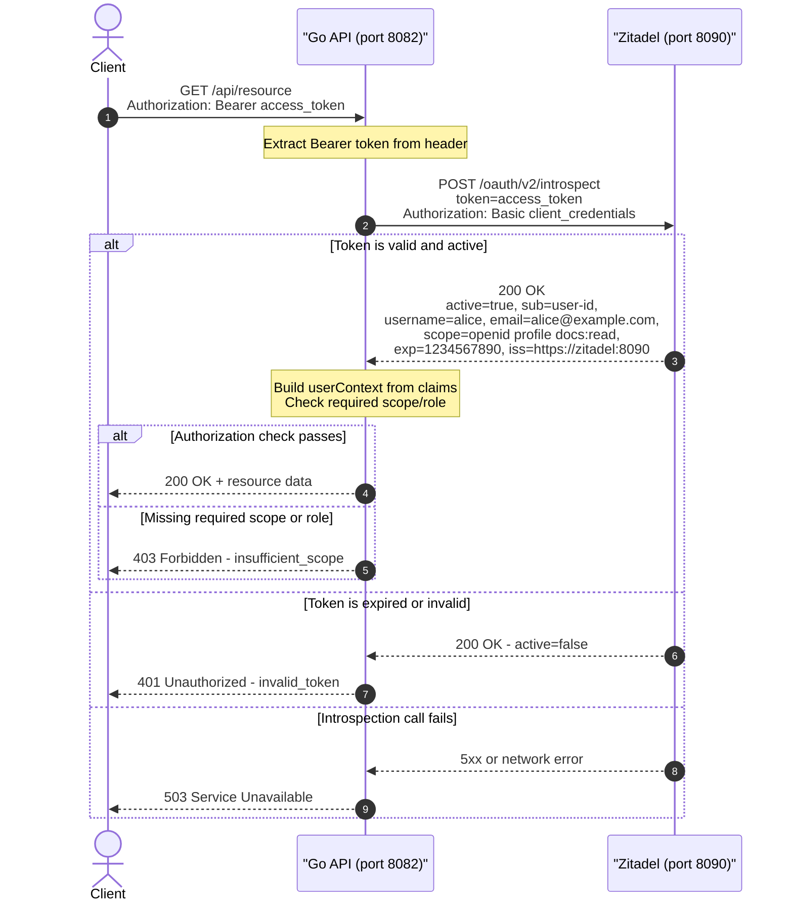

---

## 4. JWT Validation Flow (JWKS)

This sequence diagram shows the high-performance local JWT validation path using JSON Web Key Sets (JWKS). On startup the API fetches and caches Zitadel's public keys; each subsequent request validates the token signature locally without a network call to Zitadel. The cache is periodically refreshed to handle key rotation gracefully.

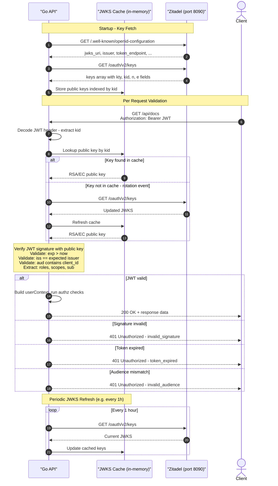

---

## 5. Client Credentials Flow (M2M)

This sequence diagram illustrates the OAuth 2.0 Client Credentials grant used for machine-to-machine (M2M) communication between backend services. There is no user interaction; Service A authenticates directly with its client credentials to obtain an access token, then uses that token to call Service B. Service B validates the token independently using introspection or local JWKS verification.

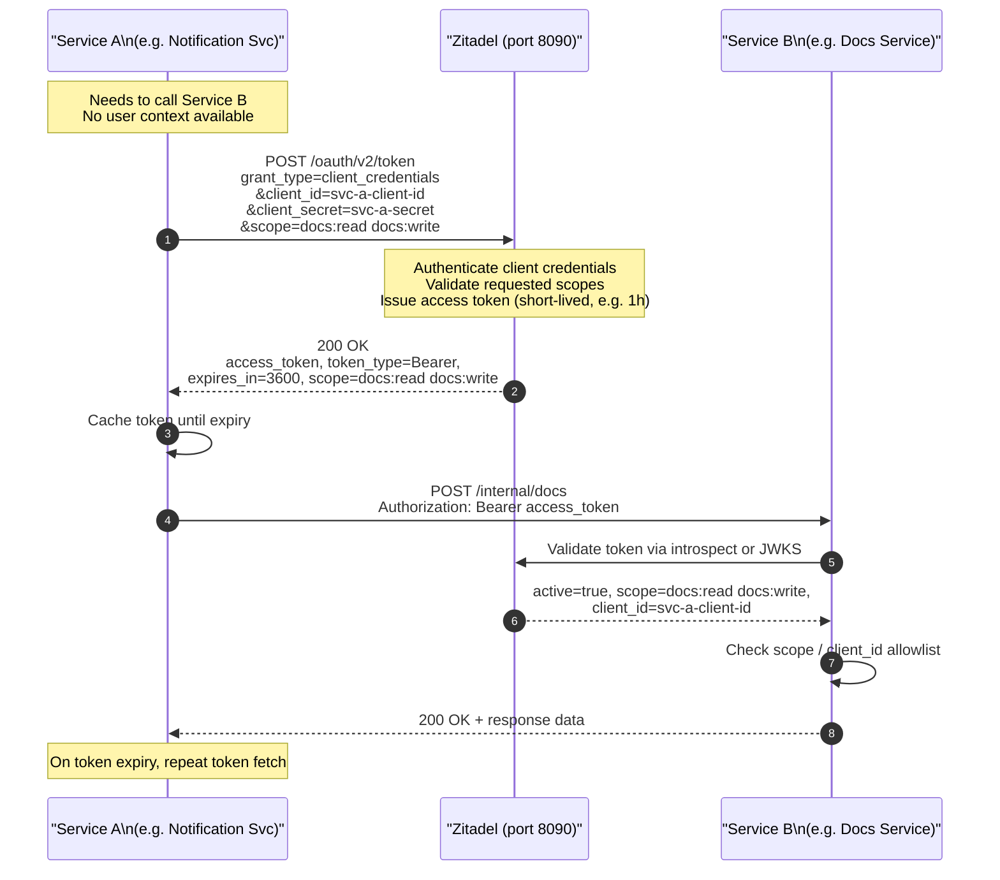

---

## 6. RBAC Decision Flow

This flowchart shows the multi-strategy authorization decision tree used in the workspace API middleware. Each endpoint declares its required authorization type (scope-based, role-based, scope-or-role, or resource-level), and the middleware evaluates the extracted claims accordingly. Deny decisions return a 403 response immediately without proceeding to the handler.

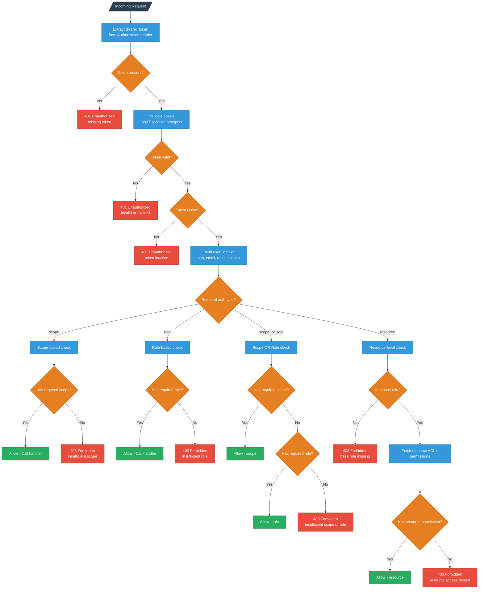

---

## 7. Google Workspace Clone - Full Architecture

This comprehensive architecture diagram shows the planned full Google Workspace clone with layered separation of concerns. The API Gateway handles all inbound traffic, enforces JWT validation and rate limiting, then routes to purpose-built microservices. Each service owns its own PostgreSQL database, shares a Redis cluster for caching, and stores files in S3-compatible object storage. All services can authenticate with Zitadel via M2M client credentials for inter-service calls.

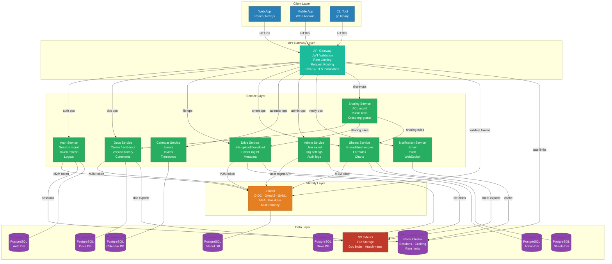

---

## 8. Multi-Tenancy Model

This diagram shows how Zitadel's organizational hierarchy enables multi-tenancy for the workspace clone. Each organization (tenant) has its own isolated user pool, project, roles, and application registrations. Cross-organization grants allow users from one organization to access resources in another with explicitly assigned roles, enabling B2B collaboration scenarios without merging user directories.

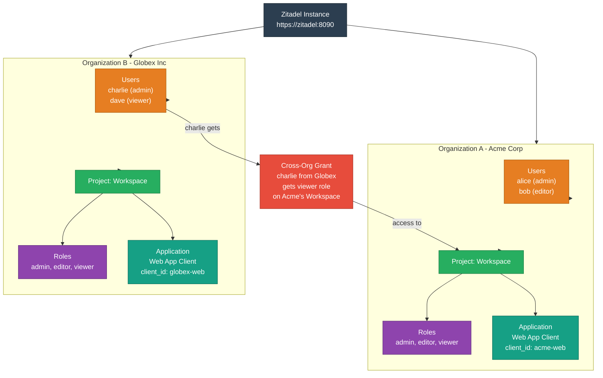

---

## 9. Request Lifecycle (Workspace POC)

This sequence diagram shows the complete middleware chain for an authenticated request in the Workspace POC. Each middleware layer has a distinct responsibility: logging, authentication (token introspection), and authorization (scope or role checking). Only after all middleware passes successfully does the request reach the business logic handler, keeping concerns cleanly separated.

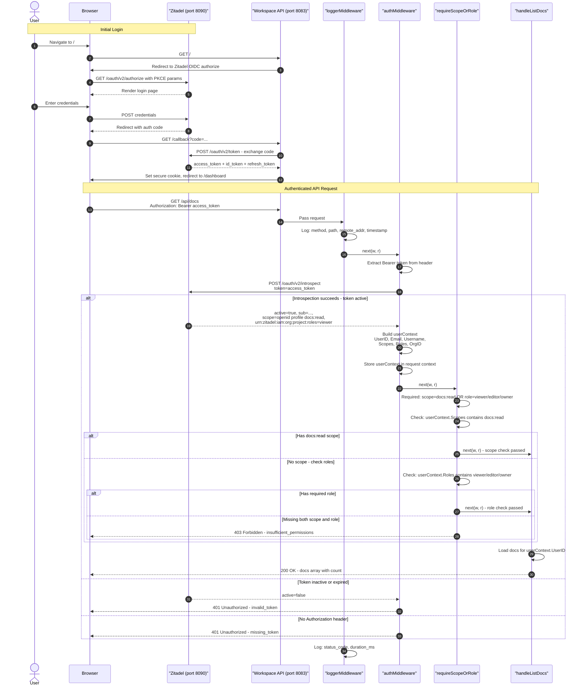

---

## 10. Future: Event-Driven Architecture

This flowchart shows how Zitadel Actions (webhooks) can feed an event bus to decouple identity events from downstream consumers. When a user is created in Zitadel, the Provisioning Service automatically creates default workspace resources (docs, drive folders, calendar) for that user. Other consumers handle audit trails, notifications, and analytics asynchronously without coupling to the identity provider.

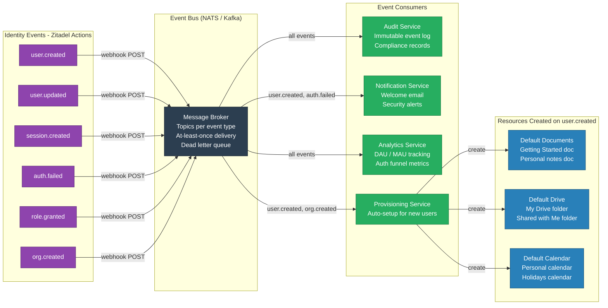

---

## 11. Deployment Architecture (Production)

This diagram shows a production-grade deployment topology with high availability at every layer. The application tier runs multiple replicas of each service behind the API Gateway, Zitadel runs in clustered mode, the data tier uses primary-replica PostgreSQL and a Redis cluster, and all infrastructure is observable via Prometheus and Grafana. The DMZ layer isolates public-facing components from internal services.

```mermaid
graph TB
    classDef lb fill:#2C3E50,stroke:#1A252F,color:#fff
    classDef dmz fill:#C0392B,stroke:#7B241C,color:#fff
    classDef app fill:#27AE60,stroke:#1A7A42,color:#fff
    classDef identity fill:#E67E22,stroke:#A85A0A,color:#fff
    classDef data fill:#8E44AD,stroke:#5E2D7A,color:#fff
    classDef monitor fill:#2980B9,stroke:#1A5276,color:#fff
    classDef storage fill:#16A085,stroke:#0C6B5A,color:#fff

    subgraph Internet["Internet"]
        Users["Users / Clients\nWeb, Mobile, CLI"]
    end

    subgraph DMZ["DMZ Layer"]
        LB["Load Balancer\nnginx / Traefik\nTLS termination\nDDoS protection\nHealth checks"]:::lb
    end

    subgraph AppTier["Application Tier"]
        subgraph GatewayCluster["API Gateway - 2 or more replicas"]
            GW1["Gateway Replica 1"]:::app
            GW2["Gateway Replica 2"]:::app
        end

        subgraph ZitadelCluster["Zitadel - 2 or more replicas"]
            Z1["Zitadel Replica 1"]:::identity
            Z2["Zitadel Replica 2"]:::identity
        end

        subgraph Services["Microservices"]
            Docs1["Docs Svc\nReplica 1"]:::app
            Docs2["Docs Svc\nReplica 2"]:::app
            Drive1["Drive Svc\nReplica 1"]:::app
            Drive2["Drive Svc\nReplica 2"]:::app
            Sheets1["Sheets Svc\nReplica 1"]:::app
            Cal1["Calendar Svc"]:::app
            Admin1["Admin Svc"]:::app
            Notif1["Notification Svc"]:::app
        end
    end

    subgraph DataTier["Data Tier"]
        subgraph PostgresCluster["PostgreSQL HA"]
            PGPrimary[("PostgreSQL\nPrimary\nread-write")]:::data
            PGReplica[("PostgreSQL\nReplica\nread-only")]:::data
        end

        subgraph RedisCluster["Redis Cluster"]
            R1[("Redis Primary")]:::data
            R2[("Redis Replica")]:::data
            R3[("Redis Replica")]:::data
        end

        S3Compat["S3-Compatible\nObject Storage\nMinIO / AWS S3\nFile blobs and exports"]:::storage
    end

    subgraph Monitoring["Monitoring Stack"]
        Prometheus["Prometheus\nMetrics scraping\nAlerting rules"]:::monitor
        Grafana["Grafana\nDashboards\nAlert routing"]:::monitor
        Loki["Loki\nLog aggregation"]:::monitor
        Tempo["Tempo\nDistributed tracing"]:::monitor
    end

    Users -->|"HTTPS :443"| LB

    LB --> GW1 & GW2

    GW1 & GW2 -->|"route"| Docs1 & Docs2
    GW1 & GW2 -->|"route"| Drive1 & Drive2
    GW1 & GW2 -->|"route"| Sheets1 & Cal1 & Admin1 & Notif1
    GW1 & GW2 -->|"validate tokens"| Z1 & Z2

    Z1 & Z2 -->|"read-write"| PGPrimary
    PGPrimary -->|"replication"| PGReplica

    Docs1 & Docs2 & Drive1 & Drive2 & Sheets1 & Cal1 & Admin1 & Notif1 -->|"read-write"| PGPrimary
    Docs1 & Docs2 & Drive1 & Drive2 & Sheets1 -->|"read"| PGReplica

    GW1 & GW2 & Notif1 -->|"cache / sessions"| R1
    R1 --> R2 & R3

    Drive1 & Drive2 & Docs1 & Docs2 & Sheets1 -->|"blob storage"| S3Compat

    GW1 & GW2 & Docs1 & Docs2 & Drive1 & Drive2 & Z1 & Z2 -->|"metrics"| Prometheus
    GW1 & GW2 & Docs1 & Docs2 & Drive1 & Drive2 & Z1 & Z2 -->|"logs"| Loki
    GW1 & GW2 & Docs1 & Docs2 -->|"traces"| Tempo
    Prometheus --> Grafana
    Loki --> Grafana
    Tempo --> Grafana
```

---

## Summary

| Diagram | Purpose | Mermaid Type |
|---|---|---|
| 1. System Overview | Current Docker Compose POC components | `graph TB` |
| 2. OIDC + PKCE Flow | Browser login with code exchange | `sequenceDiagram` |
| 3. Token Introspection | Opaque token validation via Zitadel API | `sequenceDiagram` |
| 4. JWT / JWKS Validation | Local signature verification with key cache | `sequenceDiagram` |
| 5. Client Credentials | M2M service-to-service auth | `sequenceDiagram` |
| 6. RBAC Decision Tree | Multi-strategy authorization middleware | `graph TD` |
| 7. Workspace Architecture | Full microservices + data layer design | `graph TB` |
| 8. Multi-Tenancy Model | Zitadel org hierarchy + cross-org grants | `graph TB` |
| 9. Request Lifecycle | Middleware chain in Workspace POC | `sequenceDiagram` |
| 10. Event-Driven Future | Webhook-driven async provisioning | `graph LR` |
| 11. Production Deployment | HA topology with monitoring | `graph TB` |
